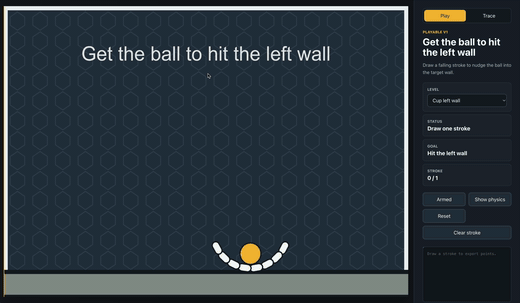
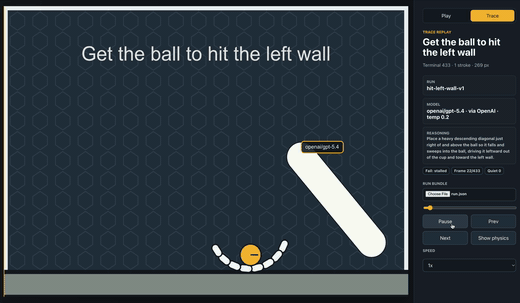

<table>
  <tr>
    <th>Human</th>
    <th>AI</th>
  </tr>
  <tr>
    <td></td>
    <td></td>
  </tr>
</table>

# Brain-It-On Benchmark

A small, inspectable benchmark for testing whether AI systems can solve one-stroke 2D physics puzzles.

The benchmark is inspired by games like Brain It On: a level starts with a ball, static obstacles, gravity, and a tight goal. A solver gets one chance to place a stroke in world coordinates. That stroke becomes a dynamic physics body, the simulation runs, and the attempt is scored by whether the resulting physical interaction completes the goal.

The aim is not to test drawing pretty shapes. It is to test physical reasoning: can a model predict how a heavy line will fall, pivot, wedge, push, or transfer momentum through a simple scene?

## What It Tests

This benchmark focuses on spatial and physical reasoning under constraints:

- **Causal physics planning:** The solver must create a shape whose motion causes the desired outcome after gravity and collisions take over.
- **Coordinate reasoning:** Actions are emitted as world-coordinate points in a fixed `1000 x 700` canvas.
- **Tool-use discipline:** Models must output valid JSON with supported stroke primitives, not free-form explanations or unsupported shapes.
- **One-shot prediction:** The current AI interface generates a candidate action before simulation starts. It does not get iterative feedback during the run.
- **Robustness to failure modes:** Runs terminate as `success`, `stalled`, or `timeout`, which makes failed attempts easier to analyze than a raw frame budget alone.

## How It Works

1. A level defines the world, ball, floor, walls, optional obstacles, goal, and stroke limits.
2. A candidate action provides one or more strokes. Current levels allow one stroke.
3. Each stroke is validated, resampled, and converted into a heavy dynamic Matter.js compound body.
4. The headless runner advances the same fixed-step simulation used by the browser prototype.
5. The stopping evaluator watches the goal, frame budget, and body movement.
6. The runner emits a compact result and writes a replayable run bundle under `runs/`.

Terminal states:

- `success`: the level goal was achieved.
- `stalled`: tracked dynamic bodies settled below movement thresholds for long enough that the attempt is considered over.
- `timeout`: the configured frame budget was exhausted.

## Current Levels

- `ground-left-wall-v1`: starts with the ball on the floor. The goal is to make the ball contact the left wall.
- `hit-left-wall-v1`: starts with the ball in a static cup-like obstacle. The goal is also left-wall contact, but the solver must first escape or use the cup geometry.

Level definitions live in [`src/sim/level.ts`](/Users/kai/Desktop/projects/brain-it-on-benchmark/src/sim/level.ts).

## Included Pieces

- Browser playground for drawing and exporting strokes.
- Headless benchmark runner for local action JSON files.
- Run bundle writer that stores results and traces in `runs/<level>/<run-id>/run.json`.
- Trace viewer for replaying run bundles in the browser.
- OpenRouter-powered AI runner for asking a model to generate a stroke.
- Validation for stroke count, stroke width, point count, numeric coordinates, and world bounds.
- Vitest coverage for simulation, stopping criteria, prompts, schema handling, and runner behavior.

## Setup

This repo uses PNPM.

```bash
pnpm install
```

Useful scripts:

```bash
pnpm dev          # start the browser playground and trace viewer
pnpm bench        # run a candidate action JSON file
pnpm ai-bench     # ask a model for an action, then benchmark it
pnpm test         # run unit tests
pnpm build        # typecheck and build the Vite app
```

## Run The Playground

Start the app:

```bash
pnpm dev
```

Open the Vite URL in your browser. In **Play** mode you can:

- choose a level,
- draw one stroke,
- pause or resume the simulation,
- toggle physics-body rendering,
- reset or clear the stroke,
- copy the exported stroke JSON from the side panel.

The exported stroke is useful for turning a human attempt into a benchmark action.

## Candidate Action Format

The benchmark runner expects a JSON object with a `levelId` and `strokes` array:

```json
{
  "levelId": "ground-left-wall-v1",
  "strokes": [
    {
      "id": "drop-pusher",
      "width": 40,
      "points": [
        { "x": 720, "y": 360 },
        { "x": 900, "y": 560 }
      ]
    }
  ]
}
```

The runner also accepts batch files shaped like:

```json
{
  "candidates": [
    {
      "levelId": "ground-left-wall-v1",
      "strokes": []
    }
  ]
}
```

Validation constraints:

- `levelId` must match a known level.
- `strokes.length` must not exceed the level limit.
- stroke `width` must be between `1` and `80`.
- each stroke must have `2` to `160` points.
- every point must stay inside the level world bounds.

## Run A Benchmark

Run a local action file:

```bash
pnpm bench sample_ground_left_wall_drop.json
```

The command prints a JSON result and writes a run bundle:

```json
{
  "levelId": "ground-left-wall-v1",
  "success": true,
  "terminalState": "success",
  "firstSuccessFrame": 76,
  "terminalFrame": 76,
  "strokeCount": 1,
  "strokeLength": 269.07,
  "runPath": "/absolute/path/to/runs/.../run.json"
}
```

Common options:

```bash
pnpm bench action.json --max-frames 900
pnpm bench action.json --runs-dir runs
pnpm bench action.json --bundle latest-run.json
pnpm bench action.json --trace trace.json
```

Use `--bundle` when you want a specific copy of the full replayable bundle. Use `--trace` when you want just the trace payload written separately.

## Local Coding Agent Workflow

Coding agents can solve levels without calling OpenRouter by editing JSON action files and running the local benchmark. The entry point is [`AGENTS.md`](/Users/kai/Desktop/projects/brain-it-on-benchmark/AGENTS.md), with templates under [`agent-workspace/agent-runs/_template`](/Users/kai/Desktop/projects/brain-it-on-benchmark/agent-workspace/agent-runs/_template).

Recommended layout:

```text
agent-workspace/agent-runs/<agent-or-model-slug>/<level-id>/attempt-001/action.json
agent-workspace/agent-runs/<agent-or-model-slug>/<level-id>/attempt-001/notes.md
agent-workspace/agent-runs/<agent-or-model-slug>/<level-id>/attempt-002/action.json
```

Run an attempt and write a stable trace bundle next to it:

```bash
pnpm bench agent-workspace/agent-runs/<agent-or-model-slug>/<level-id>/attempt-001/action.json --bundle agent-workspace/agent-runs/<agent-or-model-slug>/<level-id>/attempt-001/run.json
```

The CLI returns the pass/fail summary and a generated `runPath`. Agents should copy the result, generated `runPath`, and attempt-local `run.json` path into that attempt's `notes.md`, then create the next numbered attempt when they want to iterate. Root `runs/` remains gitignored, while `agent-workspace/agent-runs/.../attempt-NNN/run.json` gives each model attempt a stable trace to upload in the viewer.

## View Traces

Every benchmark run writes a full run bundle to:

```text
runs/<level-id>/<timestamp-and-source>/run.json
```

To replay one:

1. Start the browser app with `pnpm dev`.
2. Switch from **Play** to **Trace**.
3. Upload a `run.json` bundle from the `runs/` directory.
4. Use play, pause, previous frame, next frame, scrubber, speed, and physics-body controls to inspect the attempt.

Trace bundles include the level, action, result, metadata, and per-frame dynamic body state. AI-generated runs can also include model metadata and the model's reasoning string.

Do not read an entire `run.json` into an agent context. Use the browser trace viewer for visual inspection, or sample only summary fields and a few frames. See [`agent-workspace/docs/trace-guide.md`](/Users/kai/Desktop/projects/brain-it-on-benchmark/agent-workspace/docs/trace-guide.md) and [`agent-workspace/examples/example-trace-excerpt.json`](/Users/kai/Desktop/projects/brain-it-on-benchmark/agent-workspace/examples/example-trace-excerpt.json).

## Run The AI Benchmark

The AI runner asks an OpenRouter model to generate a valid stroke action, then immediately runs the benchmark and writes a trace bundle.

Create `.env.local` with:

```bash
OPENROUTER_API_KEY=your_key_here
```

Run:

```bash
pnpm ai-bench ground-left-wall-v1
```

Options:

```bash
pnpm ai-bench hit-left-wall-v1 --model openai/gpt-5.4-mini
pnpm ai-bench ground-left-wall-v1 --temperature 0.2 --seed 1
pnpm ai-bench ground-left-wall-v1 --timeout-ms 60000 --max-frames 900
```

The default model is `openai/gpt-5.4-mini`. The model-facing prompt describes the coordinate system, level geometry, goal, stroke constraints, valid schema, and invalid examples. Prompt code lives in [`src/ai/prompt.ts`](/Users/kai/Desktop/projects/brain-it-on-benchmark/src/ai/prompt.ts).

## Project Layout

```text
src/sim/      Shared Matter.js simulation, levels, stroke bodies, stopping criteria
src/bench/    Candidate validation, headless runner, run bundle writing, CLI
src/ai/       OpenRouter client, prompt builder, AI benchmark CLI
src/main.ts   Browser playground and trace viewer
public/       README GIFs and static assets
runs/         Generated benchmark run bundles
agent-workspace/ Tracked agent instructions, attempt templates, and trace guide
```

## Development Checks

Run the test suite:

```bash
pnpm test
```

Build the app:

```bash
pnpm build
```

The build runs TypeScript first, then Vite.

## Future Next Steps

The current version is intentionally small. Useful next steps:

- Add more levels that isolate different physical skills: lifting, tipping, bridging, momentum transfer, object removal, and multi-object interaction.
- Stabilize a serializable level fixture format so new benchmark levels do not need to be TypeScript objects.
- Add aggregate scoring across a level suite, including per-level success rate, terminal-state distribution, and frame-to-success.
- Add richer trace comparison, including side-by-side human versus model replays.
- Expand action formats carefully, such as SVG path input compiled down to the same stroke representation.
- Add screenshot or structured-vision variants of the AI prompt to compare text-only and visual-input solvers.
- Tune physics and stopping thresholds against a larger corpus of failed and successful attempts.
- Publish a fixed benchmark set with frozen levels, prompts, schemas, and scoring rules.

## Status

This is an early benchmark prototype, but the core loop is in place: define a level, submit a stroke action, simulate it headlessly, score the result, and replay the trace.
